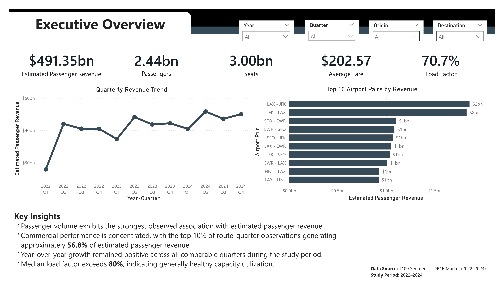
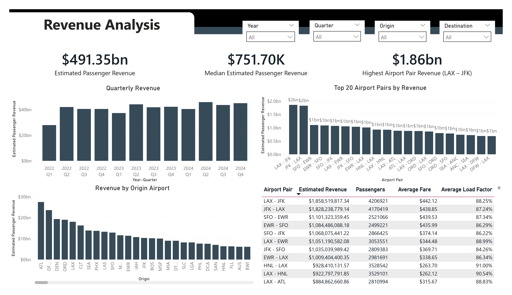
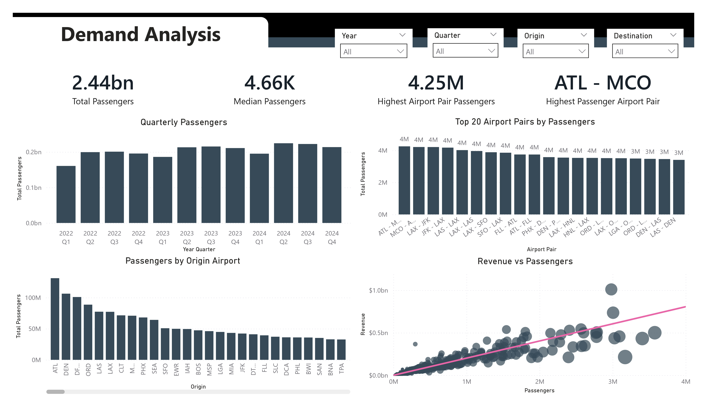
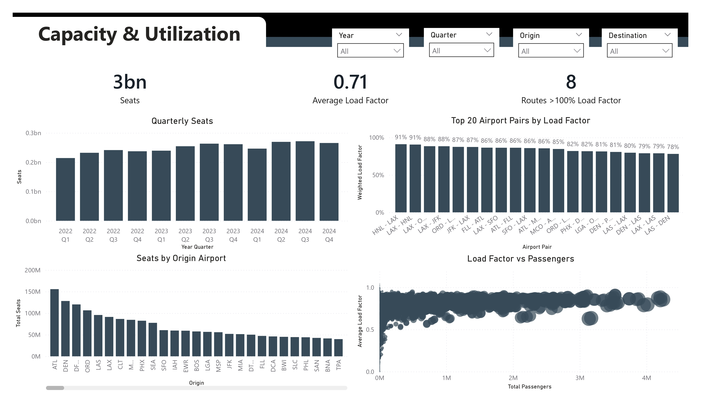
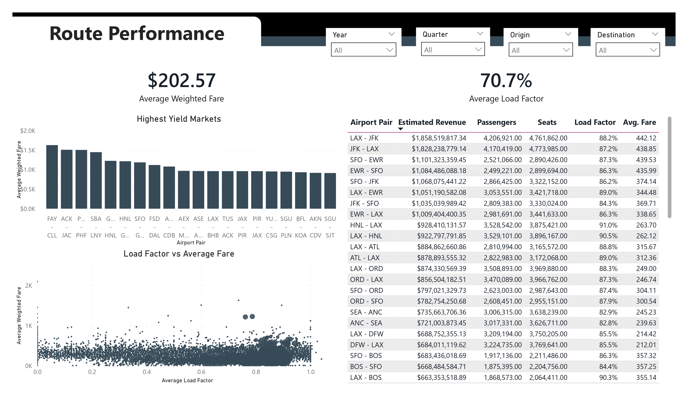

# Airline Route Performance & Estimated Passenger Revenue Analysis

> End-to-end analytics engineering and business intelligence project using SQL Server and Power BI to analyze U.S. airline route performance through operational and commercial datasets published by the U.S. Bureau of Transportation Statistics (BTS).


---

# Executive Summary

This project integrates operational flight activity from the **BTS T100 Segment** dataset with passenger fare information from the **BTS DB1B Market** dataset to estimate passenger revenue and evaluate airline route performance across the United States.

The project demonstrates a complete analytics engineering workflow:

- Data preparation
- SQL transformation
- Data validation
- Exploratory analysis
- Power BI dashboard development
- Technical documentation
- Governance and quality assurance

Rather than focusing solely on dashboard development, the project emphasizes **reproducibility, traceability, and analytical governance**.

---

# Dashboard Preview

> 
> 
> 
> 
> 
```
05_dashboard/dashboard_screenshots/
```
---

# Business Problem

Airline performance is often evaluated using operational metrics such as passenger volume or flight counts.

However, understanding the **commercial value of individual routes** requires combining operational activity with passenger fare information.

This project answers questions such as:

- Which airport pairs generate the highest estimated passenger revenue?
- Which routes carry the greatest passenger demand?
- Which markets exhibit the highest operational efficiency?
- How concentrated is airline revenue across the network?
- How do fare, passenger demand, and load factor interact?

---

# Project Objectives

- Integrate BTS operational and fare datasets.
- Develop a passenger-weighted revenue estimation methodology.
- Build a validated analytical dataset.
- Create an interactive Power BI dashboard.
- Document the complete analytical workflow.

---

# Data Sources

| Dataset | Purpose |
|----------|---------|
| BTS T100 Segment | Operational flight activity |
| BTS DB1B Market | Passenger fare survey |

Both datasets are published by the U.S. Bureau of Transportation Statistics.

---
## Data Acquisition

The raw datasets used in this project are **not included** in this repository because of their size (approximately 7 GB) and licensing/distribution considerations.

This project uses two publicly available datasets published by the **U.S. Bureau of Transportation Statistics (BTS) TranStats**.

| Dataset | Description |
|---------|-------------|
| **T-100 Domestic Segment** | Provides carrier-reported operational data including passengers, available seats, departures, aircraft types, and distance flown for individual flight segments. |
| **DB1B Market** | A quarterly 10% sample of airline tickets containing itinerary, fare, and market information used for estimating passenger revenue. |

### Download Sources

The datasets can be obtained from the official BTS TranStats website:

- **BTS TranStats Home:** https://www.transtats.bts.gov/
- **T-100 Domestic Segment Dataset**
  - Navigate to:
    - Aviation
    - Airline Information
    - T-100 Domestic Segment (All Carriers)
- **DB1B Market Dataset**
  - Navigate to:
    - Aviation
    - Airline Origin and Destination Survey (DB1B)
    - Market Table

> **Note**
>
> The exact download interface and query options may change over time. Always download the datasets directly from the official BTS TranStats website.

---

## Folder Structure

After downloading the datasets, organize them as follows:

```text
01_raw_data/
├── T100_Segment/
│   ├── 2020_Q1.csv
│   ├── ...
│   └── 2024_Q4.csv
│
└── DB1B_Market/
    ├── 2020_Q1.csv
    ├── ...
    └── 2024_Q4.csv
```

The SQL scripts expect the datasets to be available in the `01_raw_data` directory before execution.

---

## Project Workflow

Execute the SQL scripts in the following order:

1. **01_data_preparation.sql**
   - Cleans and standardizes the raw BTS datasets.

2. **02_transformation.sql**
   - Creates quarterly and route-level analytical tables.

3. **03_validation.sql**
   - Performs data quality and integrity checks.

4. **04_analysis.sql**
   - Generates analytical outputs and summary tables.

5. **05_route_performance_analytics.sql**
   - Produces the final analytical dataset used by the Power BI dashboard.

The resulting analytical dataset is stored in:

```text
02_processed_data/
```

---

## Power BI Dashboard

Open the Power BI report located in:

```text
05_dashboard/
```

The dashboard is connected to the processed analytical dataset generated by the SQL workflow.

---

## Reproducibility

This repository has been designed to support a reproducible analytics workflow:

```
Raw BTS Data
      │
      ▼
SQL Preparation
      │
      ▼
Transformation
      │
      ▼
Validation
      │
      ▼
Analytical Dataset
      │
      ▼
Power BI Dashboard
```

Following the workflow above will reproduce the analytical outputs and dashboard presented in this repository.

---

# Technology Stack

| Category | Technology |
|----------|------------|
| Database | SQL Server |
| Query Language | Transact-SQL |
| Visualization | Power BI Desktop |
| Documentation | Markdown |
| Version Control | Git & GitHub |

---

# Repository Structure

> 

---

# SQL Workflow

```
Raw BTS Data
        │
        ▼
01_data_preparation.sql
        │
        ▼
02_transformation.sql
        │
        ▼
03_validation.sql
        │
        ▼
04_analysis.sql
        │
        ▼
Power BI Dashboard
```

The SQL workflow creates the validated analytical dataset:

```text
dbo.route_performance_analytics
```

which serves as the project's analytical source of truth.

---

# Dashboard Pages

## Executive Overview

Provides a high-level summary of network performance, including estimated revenue, passenger volume, average fare, and operational efficiency.

---

## Revenue Analysis

Analyzes revenue concentration, leading airport pairs, revenue distribution, and quarterly revenue trends.

---

## Demand Analysis

Explores passenger demand, passenger concentration, and the relationship between demand and commercial performance.

---

## Capacity & Utilization

Evaluates seat capacity, load factor, and operational efficiency across airport pairs.

---

## Route Performance

Compares commercial and operational performance using revenue, fare, passenger volume, and load factor.

---

# Analytical Methodology

## Estimated Passenger Revenue

```
Passengers × Weighted Average Fare
```

---

## Weighted Average Fare

```
SUM(Fare × Passengers)
÷
SUM(Passengers)
```

---

## Load Factor

```
Passengers
÷
Seats
```

The project uses passenger-weighted aggregation to preserve the influence of high-volume markets and reduce statistical distortion.

---

# Documentation

Comprehensive project documentation is available in:

```
07_docs/
```

The documentation includes:

- Data Understanding Report
- Planning Report
- Transformation Strategy Report
- Dataset Integration Report
- Analytical Evidence Specification
- Dashboard Design Specification
- Master Traceability Matrix
- QA Audit Report
- Change Log
- Project Closure Report

---

# Key Deliverables

- SQL transformation pipeline
- Validated analytical dataset
- Power BI dashboard
- Technical documentation
- Governance framework
- Analytical evidence register

---

# Project Highlights

- End-to-end analytics engineering workflow
- Passenger-weighted revenue estimation
- SQL-based validation framework
- Five-page interactive Power BI dashboard
- Complete documentation suite
- Fully traceable analytical implementation

---

# Future Enhancements

Potential future improvements include:

- Interactive geospatial route visualization
- Predictive demand forecasting
- Route profitability estimation
- Airline-level benchmarking
- Incremental ETL pipeline
- Automated data refresh

---

# Acknowledgements

This project uses publicly available data published by the U.S. Bureau of Transportation Statistics (BTS).

---

# License

This repository is provided for educational and portfolio purposes.

Please review the BTS data usage policies before redistributing source datasets.
